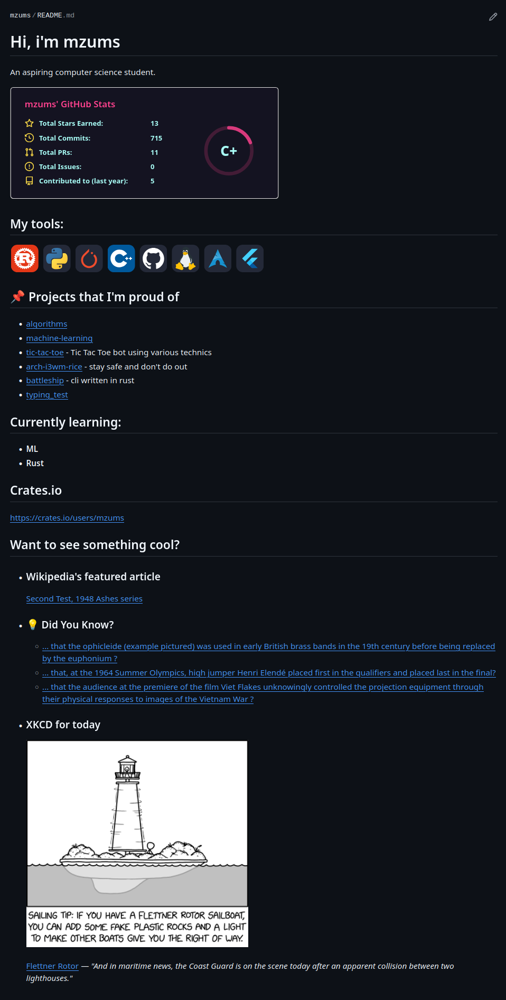

# mzums_readme

# How does it work?
- [**GitHub Readme Stats**](https://github.com/anuraghazra/github-readme-stats)
- [**tools** i use](https://skillicons.dev/)
- **Pinned projects** from [GitHub API](https://api.github.com/)
- Current **learning** section
- My profile on [**crates.io**](https://crates.io/)
- Wikipedia's **featured article** using [offical API](https://api.wikimedia.org/wiki/Main_Page)
- **Did You Know** facts scraped from Wikipedia's [main page](https://en.wikipedia.org/wiki/Main_Page)
- [current **XKCD**](https://xkcd.com/json.html)

## Updates every day at 8:00 UTC